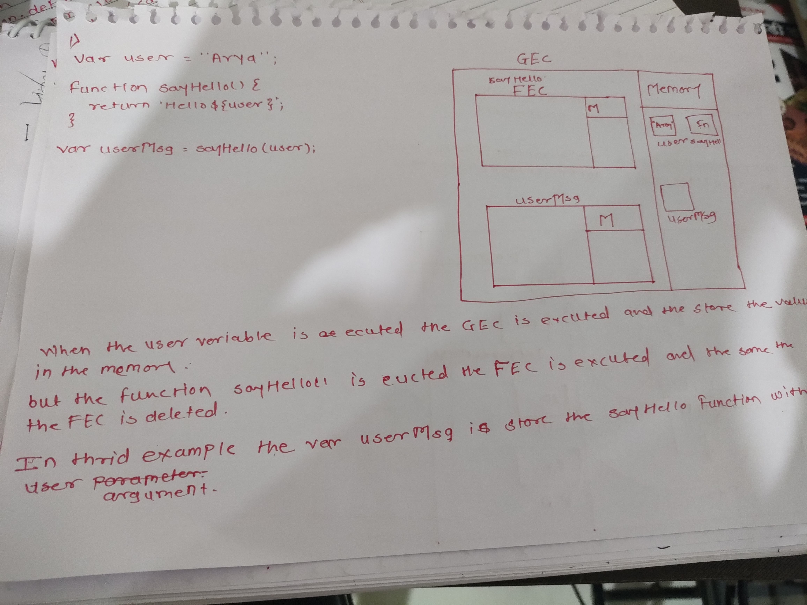
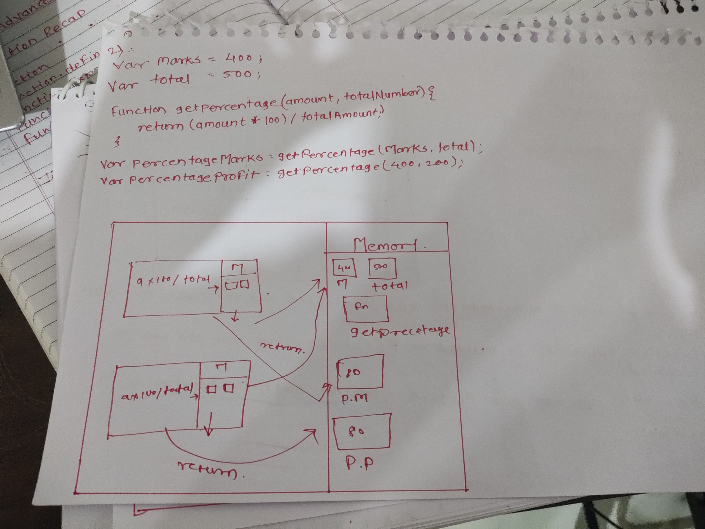
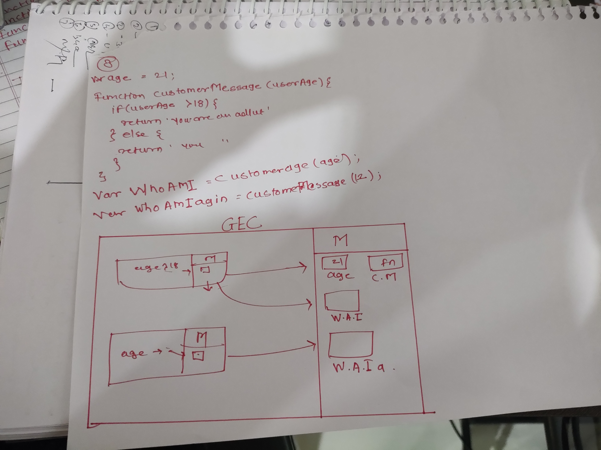

1. What does thread of execution means in JavaScript?
the paise of js engine takes line by line to execute is know as js thread.
2. Where the JavaScript code gets executed?
In js engine.
3. What does context means in Global Execution Context?
IT mean all code execute
4. When do you create a global execution context.
When js engine execute the code that time globel execution is happen.
5. Execution context consists of what all things?
Execution context is the concept for describing the internal working of a code. 
6. What are the different types of execution context?
Global Execution Context/GEC
Functional Execution Context/FEC
7. When global and function execution context gets created?
When the code has excute and the global execution is created and when function is execute the FEC is create.
8. Function execution gets created during function execution or while declaring a function.
Function execution gets created during function execution not while the declaring a function.

9. Create a execution context diagram of the following code on your notebook. Take a screenshot/photo and store it in the folder named `img`. Use `` to display it here.


```js
var user = "Arya";

function sayHello(){
  return `Hello ${user}`;
}

var userMsg = sayHello(user);
```

<!-- Put your image here -->




```js
var marks = 400;
var total = 500;

function getPercentage(amount, totalAmount){
  return (amount * 100) / totalAmount;
}

var percentageMarks = getPercentage(marks, total);
var percentageProfit = getPercentage(400, 200);
```

<!-- Put your image here -->




```js
var age = 21;

function customeMessage(userAge){
  if(userAge > 18){
    return `You are an adult`;
  }else {
    return `You are a kid`;
  }
}

var whoAmI = customeMessage(age);
var whoAmIAgain = customeMessage(12);
```

<!-- Put your image here -->

